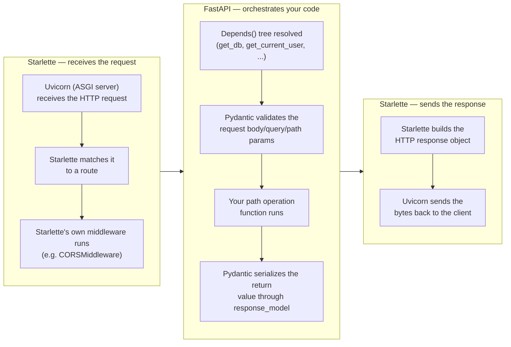
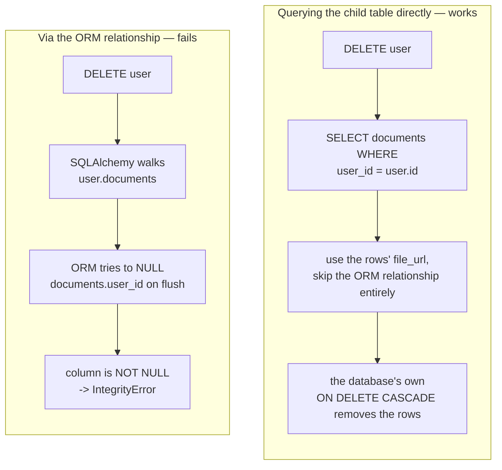
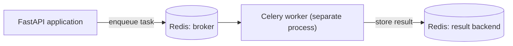
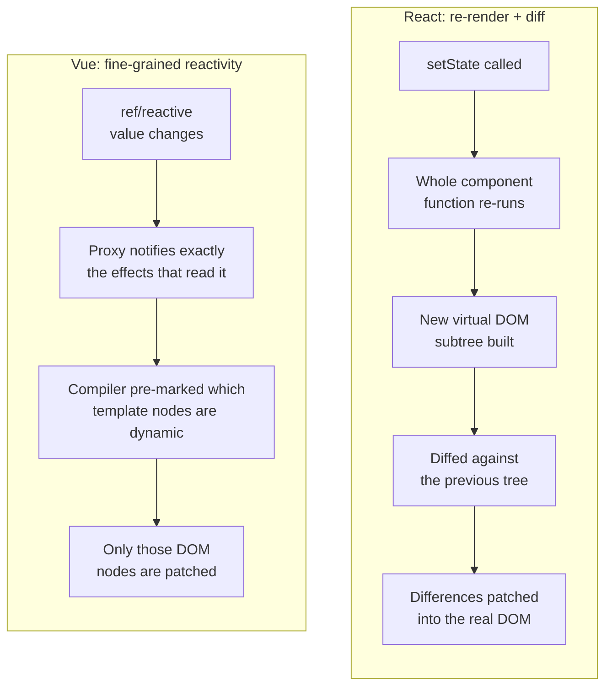
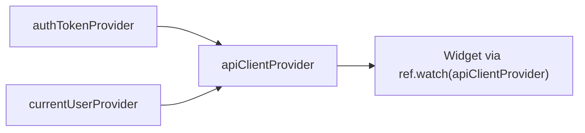
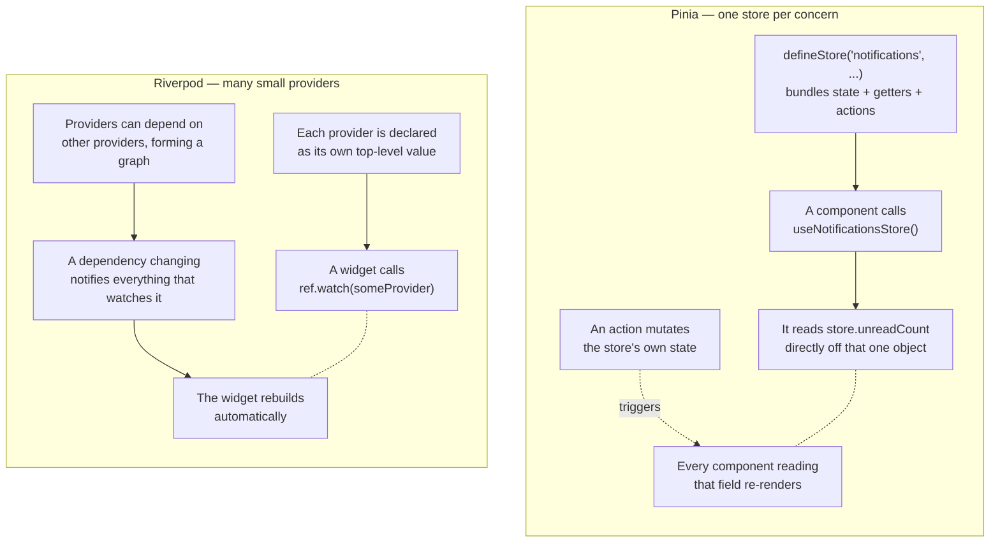
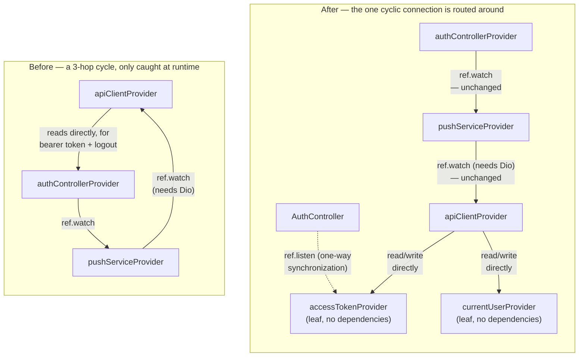
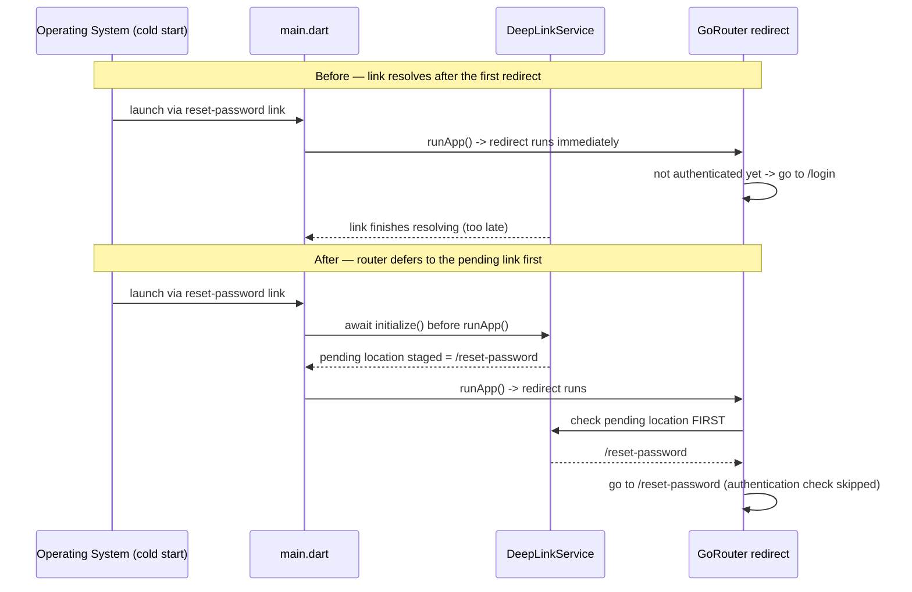

# Study Notes: Stack Fundamentals

I had never used any of these technologies before starting this project.
These are my own study notes on each one: the core ideas, how each one is
different from the tool I would have reached for instead, the parts that
genuinely confused me at first, and a couple of real problems along with how
I fixed them.

---

## FastAPI

**What it is:** FastAPI is a Python web framework for building APIs. It is
built on top of Starlette, which handles the ASGI (Asynchronous Server
Gateway Interface) web layer, and Pydantic, which handles data validation.

**How the three actually divide the work, and where a request flows
through them:**



Concretely, in this project's own `backend/app/main.py`: `app = FastAPI(...)`
is itself a Starlette application under the hood (FastAPI subclasses it);
`app.add_middleware(CORSMiddleware, ...)` is pure Starlette, handling
cross-origin requests before any of your own code runs; `app.include_router(api_router, ...)`
is FastAPI's own routing sugar on top of Starlette's router. Pydantic never
touches routing or HTTP at all — its whole job is steps 2 and 4 above:
turning raw JSON into validated Python objects on the way in, and turning
Python objects back into JSON on the way out. FastAPI is the layer in the
middle that reads your type hints and decides when to call each of the
other two.

**Core concepts:**

- **Path operations** — a function you decorate with something like
  `@app.get("/x")`. The function's type-hinted parameters and return type
  _are_ the request and response schema — you don't write them out
  separately. (See any endpoint in `backend/app/api/v1/endpoints/`, for
  example `ai.py`'s `@router.post("/resume-analyses", ...)`.)
- **Pydantic schemas** — plain Python classes that check that incoming JSON
  is valid and shape outgoing responses. A malformed request gets rejected
  before your own code ever runs. (See `backend/app/schemas/ai.py`'s
  `ResumeAnalysisCreate`/`ResumeAnalysisRead`; official docs: Pydantic's
  [Models](https://docs.pydantic.dev/latest/concepts/models/).)
- **`Depends()`** — FastAPI's dependency-injection tool. You write a
  parameter like `user: User = Depends(get_current_user)`, and FastAPI calls
  `get_current_user` for you and hands you its result. Dependencies can
  depend on other dependencies too — `get_current_user` itself depends on
  `get_db` — which is how this project splits "open a database session,
  check the JWT (JSON Web Token), load the user" into three small,
  separately-testable functions instead of one large block copied into
  every route. (See `backend/app/api/deps.py`'s `get_current_user` and
  `get_current_active_user`; official docs:
  [Dependencies](https://fastapi.tiangolo.com/tutorial/dependencies/).)
- **`yield` dependencies** — a dependency can `yield` a value instead of
  `return`ing it, which turns it into a setup-then-teardown pair: open a
  database session, let the route run, then close the session in a
  `finally` block. This is the same shape as a context manager. (See
  `backend/app/db/session.py`'s `get_db`; official docs:
  [Dependencies with yield](https://fastapi.tiangolo.com/tutorial/dependencies/dependencies-with-yield/).)
- **Background tasks** — work you want to happen after a response is sent,
  without needing a separate task queue. FastAPI's `BackgroundTasks` runs
  it right after the response goes out, fire-and-forget. (See
  `backend/app/tasks/ai_inline.py`, dispatched from
  `backend/app/api/v1/endpoints/ai.py`'s `background_tasks.add_task(...)`;
  official docs:
  [Background Tasks](https://fastapi.tiangolo.com/tutorial/background-tasks/),
  which itself wraps
  [Starlette's `BackgroundTask`](https://www.starlette.io/background/).)

**Important notes:**

- A route defined with a plain `def` is synchronous — FastAPI runs it in a
  thread pool, so it can't block the main event loop. A route defined with
  `async def` runs directly on that event loop, so a blocking call inside
  it (for example, a database driver that wasn't built to run
  asynchronously) freezes _every other request currently being handled_,
  not just its own. (Official docs:
  [Concurrency and async / await](https://fastapi.tiangolo.com/async/).)
- Dependencies are cached **per request** by default. Calling the same
  `Depends()` twice inside one request's dependency tree only actually runs
  it once — that's what makes depending on `get_db` from three different
  places cheap, instead of opening three separate database sessions. (Same
  [Dependencies](https://fastapi.tiangolo.com/tutorial/dependencies/) docs
  as above, "sub-dependencies" section.)
- **The application process has to stay stateless.** A FastAPI process
  sitting behind a load balancer might handle one request, and then have
  the very next request from that same user sent to a completely different
  instance. So anything that needs to persist — sessions, rate-limit
  counters, background-task state — has to live in the database or in
  Redis. It can never live in a plain variable inside the application
  itself. (See `backend/app/services/rate_limit.py`'s `check_and_increment`,
  which keeps its counter in Redis rather than a module-level variable.)
- **`response_model` is a security boundary, not just documentation.** A
  route that returns a database object directly can accidentally expose
  fields the caller was never meant to see, such as a password hash or an
  internal flag. Declaring an explicit response schema strips out anything
  not listed, on every single response — even after the underlying model
  later gains new columns. (Concretely: `backend/app/models/user.py`'s
  `User.password_hash` column never appears in
  `backend/app/schemas/user.py`'s `UserRead`; official docs:
  [Response Model](https://fastapi.tiangolo.com/tutorial/response-model/).)

**Best practices:**

- Centralized configuration through a single `Settings(BaseSettings)`
  class (`backend/app/core/config.py`), instead of scattered `os.environ`
  calls throughout the codebase.
- One `APIRouter()` per resource (`backend/app/api/v1/endpoints/`),
  composed into a single `api_router` via `include_router()`
  (`backend/app/api/v1/router.py`), instead of one giant file of routes.
- Separate request/response schemas per resource — e.g.
  `ResumeAnalysisCreate`/`ResumeAnalysisRead`/`ResumeAnalysisUpdate` in
  `backend/app/schemas/ai.py` — rather than reusing one schema for every
  direction.
- Tests override dependencies (`app.dependency_overrides`) instead of
  hitting a real database or real auth (`backend/tests/conftest.py`,
  `backend/tests/test_auth_endpoints.py`) — the exact seam `Depends()`
  exists to make possible.

---

## SQLAlchemy, Alembic, PostgreSQL

**What it is:** SQLAlchemy is an ORM (object-relational mapper): it maps
Python classes onto database tables, so you can write `user.documents`
instead of writing a SQL join by hand. Alembic is its migration tool —
every schema change becomes a versioned, reviewable Python script instead
of a one-off `ALTER TABLE` run by hand.

**Core concepts:**

- **Declarative models** — a Python class with typed columns that maps
  directly onto one database table. (See any file in `backend/app/models/`,
  for example `application.py`.)
- **Session (unit of work)** — a session collects your changes in memory
  and only writes them to the database when you call `commit()`. It also
  tracks every object it has touched (called the "identity map"), so
  loading the same row twice hands you back the same Python object both
  times. (See `backend/app/db/session.py`'s `SessionLocal`; official docs:
  [Session Basics](https://docs.sqlalchemy.org/en/20/orm/session_basics.html).)
- **Relationships** — `relationship()` lets you walk foreign keys as if
  they were plain Python attributes, like `application.contacts`.
  Depending on how it's set up, that either fires a query the first time
  you access it (lazy loading) or loads everything up front in one join
  (eager loading). (See `backend/app/models/user.py:69-78`'s
  `applications`/`device_tokens`/`settings`/`notifications` relationships;
  official docs:
  [Relationship Loading Techniques](https://docs.sqlalchemy.org/en/20/orm/queryguide/relationships.html).)
- **Migrations** — Alembic compares your models against the database and
  generates a script to bring the database in line. Each script has an
  `upgrade()` and a `downgrade()`, so the schema's history stays linear and
  reversible. (See the scripts under `backend/alembic/versions/`; official
  docs: [Alembic](https://alembic.sqlalchemy.org/en/latest/).)

**Important notes:**

- **An ORM's own rules and the database's own constraints are two separate
  systems, and they can conflict.** See the case study below for the
  actual `IntegrityError` this caused. (Official docs on how the two are
  meant to relate:
  [Cascades](https://docs.sqlalchemy.org/en/20/orm/cascades.html).)
- **Lazy loading can hide what's called an N+1 query problem.** Looping
  over a list of `applications` and reading `.contacts` on each one fires
  one separate query per application — unless you explicitly ask for eager
  loading up front. (See `backend/app/tasks/reminders_celery.py`'s
  `send_due_reminders`, which uses `joinedload(...).joinedload(...).joinedload(...)`
  specifically to avoid this; official docs: [Relationship Loading
  Techniques](https://docs.sqlalchemy.org/en/20/orm/queryguide/relationships.html).)
- Alembic's `autogenerate` command compares your models against the _live_
  database, not against the previous migration. That means it can miss or
  misread certain changes (for example, a change to the values inside an
  enum), so a generated migration still needs a human to read it before
  it's trusted — never a blind commit. (Official docs: [Auto Generating
  Migrations](https://alembic.sqlalchemy.org/en/latest/autogenerate.html),
  which lists exactly what it can and can't detect.)

**Case study: an ORM cascade fighting a database cascade**

Deleting a user by looping over their `.documents` relationship raised an
`IntegrityError`, even though the database column already had
`ON DELETE CASCADE` set up:



**The lesson that generalizes:** an ORM's relationship rules are their own,
separate layer of behavior — not simply a window onto the SQL underneath.
They can trigger their own cleanup logic that has nothing to do with what
the database schema already guarantees on its own.

**Best practices:**

- Shared `UUIDMixin`/`TimestampMixin` base classes
  (`backend/app/db/base_class.py`) instead of repeating `id`,
  `created_at`, and `updated_at` by hand on every model.
- UUID primary keys instead of auto-incrementing integers — avoids
  leaking row counts or sequential IDs through a public-facing API.
- `server_default` set alongside application-side defaults, so a row
  inserted outside the ORM (a manual `INSERT`, a migration backfill)
  still gets a correct default instead of `NULL`.
- Foreign keys declared with an explicit `ondelete="CASCADE"` at the
  database level, not left for the ORM alone to manage.
- Eager loading (`joinedload`) applied deliberately in real hot paths
  (`reminders_celery.py`, `ai.py`), instead of leaving lazy loading to
  quietly N+1.
- Postgres-native enum types
  (`sqlalchemy.dialects.postgresql.ENUM`), not the generic
  cross-database `Enum` — adopted after hitting the difference directly,
  fixed in commit
  [`5e5a05c`](https://github.com/danielnguyen982301/lwkapply/commit/5e5a05cf29889b2dd4e7a9a5fa17b7dc59783f48).

---

## Celery + Redis (background jobs)

**What it is:** Celery is a task queue. Instead of running a task right
inside a request, your application "enqueues" it, and separate worker
processes pick tasks up off a queue (Redis, in this project) and run them
independently of any web request. (Official docs:
[Celery](https://docs.celeryq.dev/en/stable/).)



**Why it exists:** so a slow operation — sending an email, calling an AI
service — doesn't force the caller to sit and wait for the HTTP response to
finish, and so that a task which crashes can be retried without taking the
whole API down with it.

**Important notes:**

- **A status column turns a background job from a black box into something
  you can check on.** `parse_resume_task` and `score_ats_task` save
  `PENDING`, then `PROCESSING`, then `COMPLETED` or `FAILED` as separate
  steps, instead of saving the result once at the very end (see
  `app/tasks/ai_celery.py`). That's specifically so
  `GET /ai/resume-analyses/{id}` always has a real, up-to-date answer for
  the client to check — the status column _is_ the way progress gets
  reported, not just an implementation detail.
- **Making a repeating task idempotent is just a matter of the right
  query, not a special library feature.** `send_due_reminders` only
  selects rows where `sent_at IS NULL`, and it saves each reminder as sent
  right after sending it, inside the loop, instead of saving everything
  once at the end (see `app/tasks/reminders_celery.py`). That combination
  is what lets the same scheduled run — or two overlapping runs — happen
  again safely, without re-sending anything already marked as sent.
  `app/core/celery_app.py`'s own comment calls this out directly as the
  thing that makes a duplicate run harmless.
- **A background task can't use FastAPI's request-scoped database
  dependency, because there's no request behind it.** Every task opens its
  own database session with `SessionLocal()` and closes it in a `finally`
  block (see `reminders_celery.py` and `ai_celery.py`), instead of writing
  `db: Session = Depends(get_db)` the way an endpoint would. Dependency
  injection patterns that make sense inside FastAPI's request lifecycle
  simply don't carry over to code that runs outside of it.
- **Two different kinds of triggers can feed the exact same kind of
  queue.** The tasks in `ai_celery.py` are dispatched with `.delay()` the
  moment a user makes a request — that's event-triggered. `send_due_reminders`,
  on the other hand, is fired by Celery's scheduler on a fixed timer and
  runs its own query to find work — that's interval-triggered. Same broker
  and the same worker mechanics underneath, but two different answers to
  "what decides when this task runs?" (Official docs:
  [Calling Tasks](https://docs.celeryq.dev/en/stable/userguide/calling.html)
  for `.delay()`, and
  [Periodic Tasks](https://docs.celeryq.dev/en/stable/userguide/periodic-tasks.html)
  for beat — the schedule this project's `celery_app.py` registers under
  `beat_schedule`.)

**Best practices:**

- Worker and beat run as separate processes
  (`docker-compose.yml`'s `celery-worker`/`celery-beat` services), not
  combined into one, so scheduling isn't affected by worker load or vice
  versa.
- Idempotent, resumable task design via a state check (`sent_at IS NULL`)
  plus a per-item commit inside the loop, rather than one commit at the
  end of the whole run.
- Failures inside a batch loop are logged and swallowed per item instead
  of raised — `email_smtp.py`'s and `email_gmail_api.py`'s own docstrings
  state this is deliberate, so one bad send can't take down every other
  reminder in the same run.
- A fresh `SessionLocal()` opened and closed inside each task itself,
  rather than one long-lived session shared across tasks or across the
  whole worker process.

---

## Vue 3 (versus React)

**What it is:** Vue is a "progressive" JavaScript framework for building
user interfaces out of components. It plays roughly the same role as React
(rather than something like Angular), but uses a different underlying
reactivity model.

**Core concepts:**

- **Single-File Components (`.vue` files)** — the template, the script,
  and the (optionally scoped) styles for one component all live together
  in a single file.
- **`ref`, `reactive`, and `computed`** — `ref(0)` wraps a plain value so
  Vue can detect when it's read or written. `computed()` derives a value
  that automatically re-runs whenever anything it reads changes — with no
  dependency array to maintain by hand, unlike React's
  `useMemo(fn, [dependencies])`. (Official docs: [Reactivity
  Fundamentals](https://vuejs.org/guide/essentials/reactivity-fundamentals.html)
  and React's
  [useMemo](https://react.dev/reference/react/useMemo).)
- **The Composition API (`<script setup>`)** — reusable stateful logic
  pulled out into plain functions. It's the rough equivalent of React's
  custom hooks. (Same [Reactivity
  Fundamentals](https://vuejs.org/guide/essentials/reactivity-fundamentals.html)
  docs cover this; see any `<script setup>` component under `webapp/src`.)
- **Pinia** — the global state store, roughly Vue's version of Redux or
  Zustand. (See `webapp/src/stores/`; official docs:
  [Pinia](https://pinia.vuejs.org/introduction.html).)
- **Vite** — the development server and build tool this application
  actually runs on (see `webapp/vite.config.ts`). It isn't part of Vue
  itself — plenty of React projects use Vite too. During development, it
  serves your source files directly as native ES modules over a
  lightweight server instead of bundling the whole application up front,
  so the development server starts almost instantly and only compiles a
  file the moment the browser actually asks for it. For a production build
  (`vite build`), it switches over to Rollup to bundle and optimize the
  whole application. (Official docs: [Getting
  Started](https://vite.dev/guide/) and [Building for
  Production](https://vite.dev/guide/build).) This project's configuration
  does one more concrete thing worth knowing: `server.proxy` forwards
  `/api` requests to the backend during local development, which makes the
  frontend and backend look same-origin to the browser — but only locally.
  That's the exact reason the cross-site request forgery (CSRF) protection
  bug (see the SQLAlchemy and Flutter case studies for the same kind of
  issue) never showed up until the application was deployed to two real,
  separate domains. Vitest reuses this same configuration too
  (`mergeConfig(viteConfig, vitestConfig)`), so the tests share the
  development server's own module resolution instead of running under a
  completely separate tool like Jest.

**How the reactivity model is actually different from React's:**



Both frameworks use a virtual DOM underneath — Vue hasn't gotten rid of it.
The real difference is that Vue's compiler can see the structure of your
template ahead of time and mark which parts of it can ever change (called
"patch flags"), so an update skips over static content by construction.
React's JSX is just plain JavaScript, so React can't make that same
assumption at compile time, and it re-runs more of the render by default.
In React, you opt out of that extra work yourself, using `memo`,
`useMemo`, or `useCallback`. (Official docs: Vue's [Rendering
Mechanism](https://vuejs.org/guide/extras/rendering-mechanism) for patch
flags, and React's own explanation of the virtual DOM at [Virtual DOM and
Internals](https://legacy.reactjs.org/docs/faq-internals.html).)

**Advantages and disadvantages compared to React (from actually building
with both mental models):**

|                | Vue                                                                  | React                                                         |
| -------------- | -------------------------------------------------------------------- | ------------------------------------------------------------- |
| Learning curve | Gentler — reactivity is automatic, less boilerplate for simple state | Steeper — hooks rules, dependency arrays, when-to-memoize     |
| Ecosystem/jobs | Smaller                                                              | Much larger — bigger library ecosystem                        |
| Flexibility    | More "batteries-included" and opinionated (official router/store)    | More unopinionated — you choose your own router/state library |
| Markup         | Templates (HTML-like, restricted syntax)                             | JSX (full JS expressiveness, tighter logic/markup coupling)   |

**Vue and React: the same job, under a different name.** Learning Vue
after (or alongside) React mostly means finding things you already know,
just called something else:

| Concern                                  | Vue                                                                                        | React                                   |
| ---------------------------------------- | ------------------------------------------------------------------------------------------ | --------------------------------------- |
| Local component state                    | `ref()` / `reactive()`                                                                     | `useState()`                            |
| Derived/memoized value                   | `computed()`                                                                               | `useMemo()`                             |
| React to a value changing                | `watch()` / `watchEffect()`                                                                | `useEffect()` with a dependency array   |
| Run code once, on mount                  | `onMounted()`                                                                              | `useEffect(() => {...}, [])`            |
| Cleanup on unmount                       | `onBeforeUnmount()` / `onUnmounted()`                                                      | the function `useEffect` returns        |
| Reference a DOM element directly         | template `ref`                                                                             | `useRef()`                              |
| Reusable stateful logic                  | a composable (a plain `use*` function, Composition API)                                    | a custom hook (a plain `use*` function) |
| Global/shared state                      | Pinia                                                                                      | Redux / Zustand / Context               |
| Avoid recreating a function every render | not needed the same way — Vue doesn't re-run the whole component function on every update  | `useCallback()`                         |
| Avoid re-rendering a child unnecessarily | not needed the same way — fine-grained reactivity means only what actually changed updates | `React.memo()`                          |

Official documentation for each column: Vue's
[`ref`/`reactive`/`computed`](https://vuejs.org/guide/essentials/reactivity-fundamentals.html)
and [Watchers](https://vuejs.org/guide/essentials/watchers.html); React's
[`useState`](https://react.dev/reference/react/useState),
[`useMemo`](https://react.dev/reference/react/useMemo),
[`useEffect`](https://react.dev/reference/react/useEffect),
[`useRef`](https://react.dev/reference/react/useRef),
[`useCallback`](https://react.dev/reference/react/useCallback), and
[`memo`](https://react.dev/reference/react/memo).

The last two rows aren't "Vue is missing something." They follow directly
from the reactivity difference above: React re-runs the whole component
function on every state change and expects you to opt out of the extra
work yourself, with `memo`, `useCallback`, or `useMemo`. Vue's proxy-based
tracking means only the code that actually reads a changed value runs
again in the first place, so there's simply less work to opt out of.

This mount-and-cleanup row isn't just theoretical —
`webapp/src/layouts/AppLayout.vue` does exactly this (official docs:
[Lifecycle Hooks](https://vuejs.org/guide/essentials/lifecycle.html)):

```ts
onMounted(() => {
  notifications.startPolling();
  window.addEventListener("keydown", handleEscape);
});

onBeforeUnmount(() => {
  notifications.stopPolling();
  window.removeEventListener("keydown", handleEscape);
});
```

which is the Vue-shaped version of:

```jsx
useEffect(() => {
  notifications.startPolling();
  window.addEventListener("keydown", handleEscape);
  return () => {
    notifications.stopPolling();
    window.removeEventListener("keydown", handleEscape);
  };
}, []);
```

Either way, the intent is the same: start polling and attach a listener
when the component appears, and tear both back down when it disappears.
Vue just writes "on mount" and "on unmount" as two separate function
calls, instead of one `useEffect` with a returned cleanup function.

**Important notes:**

- The `ref` versus `reactive` trap: destructuring a `reactive()` object
  loses reactivity on its individual fields — they turn into plain,
  disconnected values. A `ref` needs `.value` when you access it in your
  script, but not inside the template. (Official docs: [Reactivity
  Fundamentals](https://vuejs.org/guide/essentials/reactivity-fundamentals.html),
  "Limitations of `reactive()`" section.)
- Declaration order matters inside `<script setup>`. A
  `watch(..., { immediate: true })` runs right at the point where it's
  declared, so anything it reads has to already be declared above it —
  otherwise you hit a temporal dead zone bug. (Official docs on the option
  itself: [Watchers](https://vuejs.org/guide/essentials/watchers.html); the
  temporal-dead-zone behavior is plain JavaScript `let`/`const` scoping, not
  something Vue-specific.)
- Anything drawn on a canvas (for example, a Chart.js chart) sits
  **outside** Vue's reactivity system entirely — it's just raw pixels.
  CSS-variable-based theming, like dark mode, never reaches it unless you
  explicitly recompute the colors and redraw it yourself whenever the
  theme changes. (This project hit exactly this: commit
  [`0af1d42`](https://github.com/danielnguyen982301/lwkapply/commit/0af1d427db7b7e3c90730d48a163bf437bda5fdc),
  "make analytics charts theme-aware," in `webapp/src/`'s chart
  components.)

**Best practices:**

- Composition API with `<script setup>` used consistently across
  components, not mixed with the older Options API.
- TypeScript throughout, not plain JavaScript.
- One centralized `axios` client with interceptors
  (`webapp/src/lib/api.ts`) for auth-token attachment and refresh,
  instead of each component making its own HTTP calls.
- Form validation through a dedicated schema-validation library
  (vee-validate + `@vee-validate/zod`, used across 18 components),
  replacing an earlier hand-rolled `reactive()` + manual `validate()`
  approach — a real example of adopting a better practice after starting
  without it (see `CHANGELOG.md`'s v0.5.0 entry).
- Pinia for global state instead of prop-drilling or a hand-rolled event
  bus.

---

## Flutter + Riverpod (versus React Native)

**What it is:** Flutter is Google's UI toolkit for compiling a single Dart
codebase down to native ARM machine code for both iOS and Android.

**What makes it different from React Native:** Flutter doesn't hand off to
native platform widgets at all — it ships its own rendering engine (Skia,
or the newer Impeller) and draws every single pixel itself. That gives you
pixel-identical UI across iOS and Android, with no bridge or serialization
overhead in between. But it also means Flutter has to reimplement what a
native look and feel is on its own (its Material and Cupertino widget
sets) — it doesn't get real native components for free the way React
Native does through its actual native-widget bridge. (Official docs:
[Impeller rendering engine](https://docs.flutter.dev/perf/impeller).)

**Core concepts:**

- **Everything is a widget** — layout, styling, even plain padding, are
  all widgets composed together into one tree. (Official docs:
  [Widgets](https://docs.flutter.dev/get-started/fundamentals/widgets).)
- **`StatelessWidget` versus `StatefulWidget`** — the basic split between a
  widget that simply renders from its inputs, and one that owns mutable
  state of its own that can trigger a rebuild. (Official docs: [Add
  interactivity to your Flutter app](https://docs.flutter.dev/ui/interactivity).)
- **Riverpod providers** — a declarative dependency-injection and state
  layer, made up of providers such as `authTokenProvider` and
  `apiClientProvider`. A widget calls `ref.watch(someProvider)` and
  rebuilds automatically whenever that provider's value changes. It plays
  roughly the same role that Pinia or Redux play on the web, just wired
  through the widget tree instead of through one global store object. (See
  `mobile/lib/features/auth/presentation/session_providers.dart`; official
  docs:
  [Providers](https://riverpod.dev/docs/concepts2/providers).)



**Riverpod (mobile) versus Pinia (web) — same underlying job, different
shape:**



The underlying mechanism is the same idea in both: something outside the
component holds state, the component subscribes to it, and a change
notifies every subscriber to update — neither one makes the component
poll or manually diff anything itself. What differs is granularity and
shape. Pinia (see `webapp/src/stores/notifications.ts`'s
`defineStore('notifications', { state, getters, actions })`) bundles
one _domain's_ state, derived values, and mutating logic into a single
store object, read as a whole via `useNotificationsStore()`. Riverpod
(see `mobile/lib/features/auth/presentation/session_providers.dart`)
instead splits state into many small, independent providers —
`accessTokenProvider`, `currentUserProvider`, and so on — that are wired
together into a dependency graph, each one watched individually. Rough
equivalences: `defineStore()` ≈ declaring a provider; `useXStore()` in a
component ≈ `ref.watch(xProvider)` in a widget; an action mutating store
state ≈ a controller/notifier setting `provider.state`; a Pinia getter
(derived state) ≈ one provider reading another and deriving a value from
it.

**Important notes:**

- **A provider cycle can hide behind two layers of indirection, not just
  two providers reading each other directly.** The actual cycle here ran
  three hops deep: `apiClientProvider` read `authControllerProvider`
  directly, to get the bearer token and to trigger a logout or a silent
  refresh on a 401 response. `authControllerProvider` itself watched
  `pushServiceProvider`. And `pushServiceProvider` watched
  `apiClientProvider` — closing the loop three providers away from where
  the original read even happened. Riverpod doesn't catch this at compile
  time; it only throws a `CircularDependencyError` at runtime, the very
  first time something actually triggers the lazy read that completes the
  cycle. The fix wasn't "split things into more providers" as some kind of
  general rule. It was finding the _one specific connection_ that closed
  the loop — `apiClientProvider` reading `authControllerProvider` — and
  routing around exactly that connection: `apiClientProvider` now reads
  and writes two new, dependency-free "leaf" providers directly,
  `accessTokenProvider` and `currentUserProvider`, and `AuthController`
  stays the source of truth by listening to them one-way with
  `ref.listen`, rather than being read by `apiClientProvider` at all. The
  rule that actually generalizes, in the fix's own words: a provider must
  never read anything that transitively depends back on it — not "give
  every value its own provider." (Fixed in
  [`c9e24de`](https://github.com/danielnguyen982301/lwkapply/commit/c9e24de100878a643a96008aaa2d2529193aee6a).)



Notice what stays exactly the same on both sides: `pushServiceProvider`
still needs `apiClientProvider`, and `authControllerProvider` still
watches `pushServiceProvider`. Neither of those two connections was ever
the problem, and neither one moved. The only connection that changed is
the one at the top: `apiClientProvider` no longer points at
`authControllerProvider` at all. Once that single connection is gone,
`authControllerProvider -> pushServiceProvider -> apiClientProvider` is
just a one-way chain again, not a loop — because nothing at the end of it
points back to where it started.

- **Starting up an application is not one single, synchronous event.**
  Restoring an authentication session, setting up routing, and resolving a
  deep link are all separate, independent processes that run
  asynchronously — and any one of them can finish before the others. See
  the case study below for the actual bug this caused.
- **`ref.watch` rebuilds everything underneath it in that widget.** If a
  widget watches a large state object but only actually needs one field
  from it, the whole widget rebuilds on _any_ change to that object. Using
  `.select((s) => s.field)` instead scopes the rebuild down to just the
  one field that's actually used — the difference between updating a
  single row and re-rendering the entire screen. (See
  `mobile/lib/features/notifications/presentation/notification_bell_button.dart`'s
  `notificationsControllerProvider.select((state) => state.unreadCount)`;
  official docs: [How to reduce provider/widget
  rebuilds](https://riverpod.dev/docs/how_to/select).)
- **A provider's lifecycle has to be chosen on purpose.** An `autoDispose`
  provider tears its state down as soon as nothing is watching it anymore
  — the right choice for state scoped to one screen, so it doesn't
  quietly pile up over a long session. A plain provider, by contrast,
  lives for the entire lifetime of the application. Picking the wrong one
  either leaks state that should have been cleared out, or throws away
  state earlier than the feature actually needs it to survive. (See
  `mobile/lib/features/ai/presentation/resume_analysis_detail_controller.dart`,
  whose own comment notes `autoDispose` stops its polling timer
  automatically; official docs: [Automatic
  disposal](https://riverpod.dev/docs/concepts2/auto_dispose).)
- **Flutter's build, layout, and paint steps all run on a single UI
  thread.** Heavy, synchronous work done inside a widget's build path —
  parsing a large file, or decoding a big block of JSON — blocks that same
  thread, and that freezes the entire user interface, not just the one
  widget doing the work. That kind of work needs to go through Flutter's
  `compute()` function, or a separate isolate, instead. (This is general
  Flutter knowledge, not something this app's own code demonstrates —
  `mobile/lib` has no `compute()` or manual `Isolate` usage, since resume
  parsing happens server-side. Official docs:
  [Isolates](https://docs.flutter.dev/perf/isolates) and the
  [`compute()`](https://api.flutter.dev/flutter/foundation/compute.html)
  API reference.)

**Case study: a deep link racing the router's own redirect**

Cold-starting the application through a password-reset link landed on the
login screen instead of the reset screen. Two independent asynchronous
processes — resolving the deep link, and the router's own authentication
redirect — could each finish first, and whichever one won decided the
outcome. (See `mobile/lib/main.dart`,
`mobile/lib/features/auth/data/deep_link_service.dart`, and
`mobile/lib/app/router.dart`; fixed in
[`ac19b4b`](https://github.com/danielnguyen982301/lwkapply/commit/ac19b4bf45756bbc1b0413fa7139a6fb08ff4eff);
the router's redirect mechanism itself is go_router's [Redirection
topic](https://pub.dev/documentation/go_router/latest/topics/Redirection-topic.html).):



**The lesson that generalizes:** when more than one asynchronous source
can each decide where a screen ends up, one of them has to become the
single source of truth that the others defer to. You can't let each one
push its own navigation independently and just hope the timing works out.

**Best practices:**

- Sensitive data (auth tokens) stored via `flutter_secure_storage`
  (Keychain on iOS, Keystore-backed on Android), not plain
  `SharedPreferences`.
- Clear data/domain/presentation layering per feature (for example,
  `mobile/lib/features/applications/{data,domain,presentation}`), instead
  of piling everything into one file per screen.
- One centralized `Dio` client with interceptors for token injection and
  refresh (`core/network/api_client.dart`), rather than each API call
  handling auth separately.
- `autoDispose` applied by default across list/detail controllers, so
  screen-scoped state doesn't quietly accumulate over a long session.
- Route guarding centralized in `GoRouter`'s own `redirect`, not
  scattered across per-screen auth checks.

---

## Infrastructure & deployment

**What this teaches, in general:** the architecture that looks "correct"
in a tutorial usually assumes infrastructure you might not actually have —
a persistent worker process, a verified email-sending domain, unrestricted
outbound network ports. Real-world deployment means designing around
whatever constraints you're actually running under. See the Deployment
section of the main README for the specific trade-offs this project made
— moving from Celery to a cron-triggered endpoint, and from SMTP to the
Gmail API — and why.
